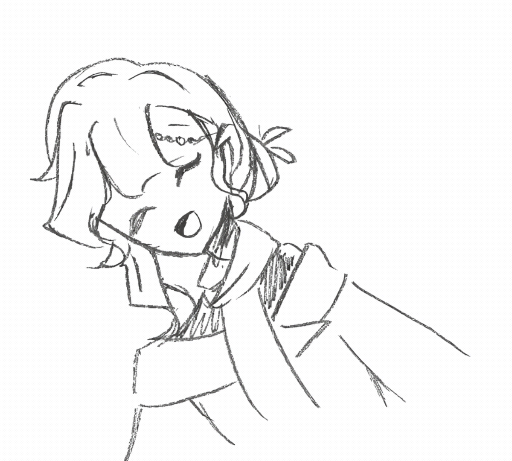

<!-- WAVE HEADER ANIMADO -->

<!-- GAME OF LIFE -->
# My GitHub contributions as a Game of Life

<!-- SEPARADOR OLA -->

 

<!-- FILA: gif saludo + descripción -->
<table align="center" border="0" cellpadding="16">
  <tr>
    <td align="center" width="180">
      <table border="0" cellpadding="4" bgcolor="#5fa8d3"><tr><td>
        
      </td></tr></table>
    </td>
    <td align="left">
      

        🌙 &nbsp;<em>Estudiante de Ingeniería Industrial.</em> 
        🌙 &nbsp;<em>Profesional en gestión y mantenimiento de maquinaria industrial.</em> 

        🎨 Dibujante por pasión.
        🌊 La playa y el anime son mi mundo.
        ✨ Detallista, puntual, comprometida.

</table>

 

<!-- GIF dibujos centrado -->

  <table border="0" cellpadding="6" bgcolor="#5fa8d3">
    <tr>
      <td align="center">
        
      </td>
    </tr>
  </table>

 

<!-- WAVE FOOTER -->

  

